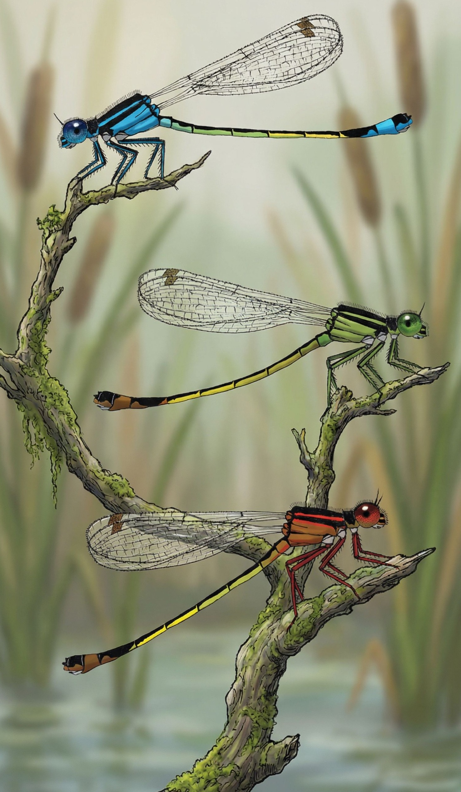

# FluctSel-Ischnura
Bioinformatics pipeline for analyzing fluctuating selection in the Common Bluetail Damselfly (*Ischnura elegans*). This project uses low-coverage whole-genome sequencing (lcWGS) to investigate how selection operates across life stages (aquatic nymphs vs. terrestrial adults) and across generations to maintain genetic diversity in natural populations.


## Setup
This analyses uses [PopGLen v0.4.3](https://github.com/zjnolen/PopGLen) as its main tool and its documentation can be found here: https://zjnolen.github.io/PopGLen/v0.4.3/.

### Environment Setup
Create mamba environment (-n names the environment, -c channels to use, -y auto selects yes to all prompts)
```bash
mamba create -n popglen -c conda-forge -c bioconda snakemake snakedeploy singularity snakemake-executor-plugin-slurm -y
```

## Configuration

### Dardel Profile Setup

The configuratons in `profiles/` and `config` specify paths, resources, and which snakemake rules are to be run. 

Each unique user has to make their own `profiles/<username>/config.yaml` and specify it while running snakemake to avoid permission conflicts.

Each unique analysis would ideally require their own unique `config/config.yml` to avoid continously changing the `dataset` yaml option. The `config` tells snakemake which rules to run using which data (`samples.tsv` and `units.tsv`).

```bash
# Copy the template and customize them to your system
cp -r profiles/dardel-template profiles/dardel-<username>
cp -r config/config-template.yaml config/config-<dataset>.yaml
```

## Running the Pipeline

```bash
# Load the module
module load tmux/3.4

# Start a new session with a name
tmux new -s snakemake

# Make sure you are in the FluctSel-Ischnura directory
cd /path/FluctSel-Ischnura

# Activate popglen
mamba activate popglen

# Run this command with YOUR profile and config. Example is using mine.
snakemake --profile profiles/dardel-<username> --configfile config/config-<dataset>.yaml
```
You can now detach from screen and have snakemake run in the background even if you close your connection/terminal.

- Detach from screen: Press `Ctrl+B`, then press `D`
- Check if it's still running: `tmux ls`
- Reattach to check progress: `tmux attach -t snakemake`
- Kill the session: `kill-session -t snakemake`

## References
> Nolen ZJ, PopGLen—a Snakemake pipeline for performing population genomic analyses using genotype likelihood-based methods, Bioinformatics, Volume 41, Issue 3, March 2025, btaf105, https://doi.org/10.1093/bioinformatics/btaf105

> Chen, S., Zhou, Y., Chen, Y., & Gu, J. (2018). fastp: An ultra-fast all-in-one FASTQ preprocessor. Bioinformatics, 34(17), i884–i890. <https://doi.org/10.1093/bioinformatics/bty560>

> Li, H., & Durbin, R. (2009). Fast and accurate short read alignment with Burrows–Wheeler transform. Bioinformatics, 25(14), 1754–1760. <https://doi.org/10.1093/bioinformatics/btp324>

> Danecek, P., Bonfield, J. K., Liddle, J., Marshall, J., Ohan, V., Pollard, M. O., Whitwham, A., Keane, T., McCarthy, S. A., Davies, R. M., & Li, H. (2021). Twelve years of SAMtools and BCFtools. GigaScience, 10(2). <https://doi.org/10.1093/gigascience/giab008>

> Picard toolkit. (2019). Broad Institute, GitHub Repository. <https://broadinstitute.github.io/picard/>

> Peltzer, A., Jäger, G., Herbig, A., Seitz, A., Kniep, C., Krause, J., & Nieselt, K. (2016). EAGER: Efficient ancient genome reconstruction. Genome Biology, 17(1), Article 1. <https://doi.org/10.1186/s13059-016-0918-z>

> Auwera, G. A. V. der, & O’Connor, B. D. (2020). Genomics in the Cloud: Using Docker, GATK, and WDL in Terra. O’Reilly Media, Inc.

> Jónsson, H., Ginolhac, A., Schubert, M., Johnson, P. L. F., & Orlando, L. (2013). mapDamage2.0: Fast approximate Bayesian estimates of ancient DNA damage parameters. Bioinformatics, 29(13), 1682–1684. <https://doi.org/10.1093/bioinformatics/btt193>

> Neukamm, J., Peltzer, A., & Nieselt, K. (2021). DamageProfiler: Fast damage pattern calculation for ancient DNA. Bioinformatics, 37(20), 3652–3653. <https://doi.org/10.1093/bioinformatics/btab190>

> Jun, G., Wing, M. K., Abecasis, G. R., & Kang, H. M. (2015). An efficient and scalable analysis framework for variant extraction and refinement from population scale DNA sequence data. Genome Research, gr.176552.114. <https://doi.org/10.1101/gr.176552.114>

> García-Alcalde, F., Okonechnikov, K., Carbonell, J., Cruz, L. M., Götz, S., Tarazona, S., Dopazo, J., Meyer, T. F., & Conesa, A. (2012). Qualimap: Evaluating next-generation sequencing alignment data. Bioinformatics, 28(20), 2678–2679. <https://doi.org/10.1093/bioinformatics/bts503>

> Fox, E. A., Wright, A. E., Fumagalli, M., & Vieira, F. G. (2019). ngsLD: Evaluating linkage disequilibrium using genotype likelihoods. Bioinformatics, 35(19), 3855–3856. <https://doi.org/10.1093/bioinformatics/btz200>

> Meisner, J., & Albrechtsen, A. (2018). Inferring Population Structure and Admixture Proportions in Low-Depth NGS Data. Genetics, 210(2), 719–731. <https://doi.org/10.1534/genetics.118.301336>

> Skotte, L., Korneliussen, T. S., & Albrechtsen, A. (2013). Estimating Individual Admixture Proportions from Next Generation Sequencing Data. Genetics, 195(3), 693–702. <https://doi.org/10.1534/genetics.113.154138>

> Waples, R. K., Albrechtsen, A., & Moltke, I. (2019). Allele frequency-free inference of close familial relationships from genotypes or low-depth sequencing data. Molecular Ecology, 28(1), 35–48. <https://doi.org/10.1111/mec.14954>

> Hanghøj, K., Moltke, I., Andersen, P. A., Manica, A., & Korneliussen, T. S. (2019). Fast and accurate relatedness estimation from high-throughput sequencing data in the presence of inbreeding. GigaScience, 8(5), giz034. <https://doi.org/10.1093/gigascience/giz034>

> Korneliussen, T. S., Albrechtsen, A., & Nielsen, R. (2014). ANGSD: Analysis of Next Generation Sequencing Data. BMC Bioinformatics, 15(1), Article 1. <https://doi.org/10.1186/s12859-014-0356-4>

> Vieira, F. G., Albrechtsen, A., & Nielsen, R. (2016). Estimating IBD tracts from low coverage NGS data. Bioinformatics, 32(14), 2096–2102. <https://doi.org/10.1093/bioinformatics/btw212>

> Flynn, J. M., Hubley, R., Goubert, C., Rosen, J., Clark, A. G., Feschotte, C., & Smit, A. F. (2020). RepeatModeler2 for automated genomic discovery of transposable element families. Proceedings of the National Academy of Sciences, 117(17), 9451–9457. <https://doi.org/10.1073/pnas.1921046117>

> Smit, A., Hubley, R., & Green, P. (2013). RepeatMasker Open-4.0 (4.1.2) [Computer software]. <http://www.repeatmasker.org>

> Pockrandt, C., Alzamel, M., Iliopoulos, C. S., & Reinert, K. (2020). GenMap: Ultra-fast computation of genome mappability. Bioinformatics, 36(12), 3687–3692. <https://doi.org/10.1093/bioinformatics/btaa222>

> Quinlan, A. R. & Hall, I. M. (2010). BEDTools: a flexible suite of utilities for comparing genomic features. Bioinformatics, 26(6), 841-842. <https://doi.org/10.1093/bioinformatics/btq033>

